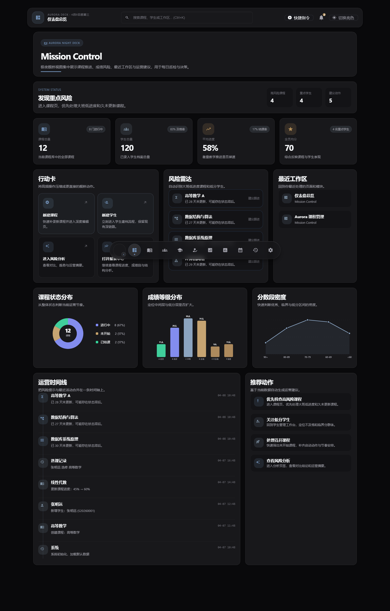
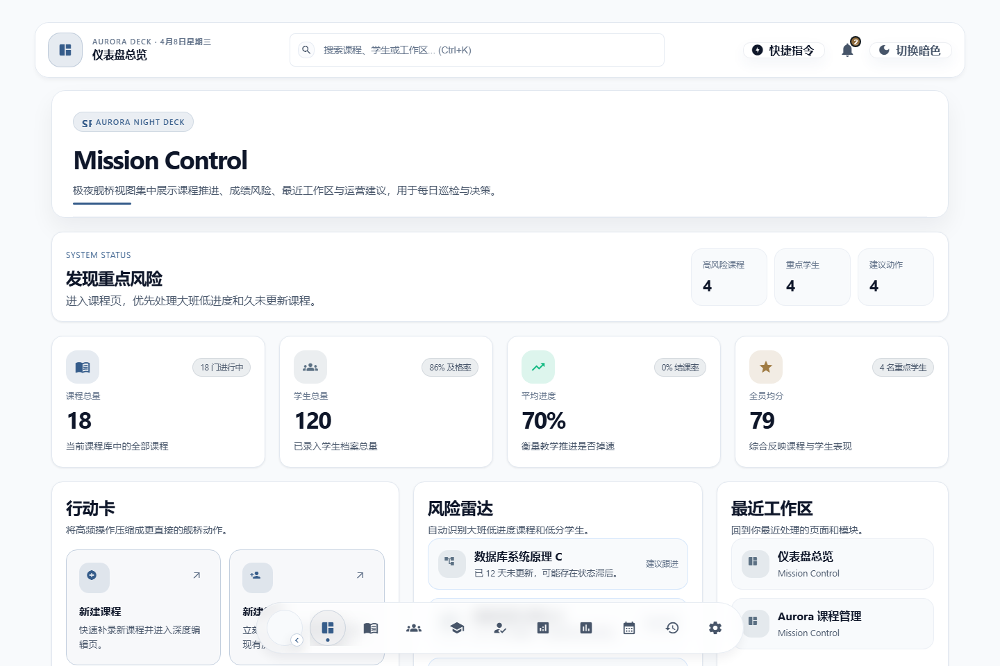
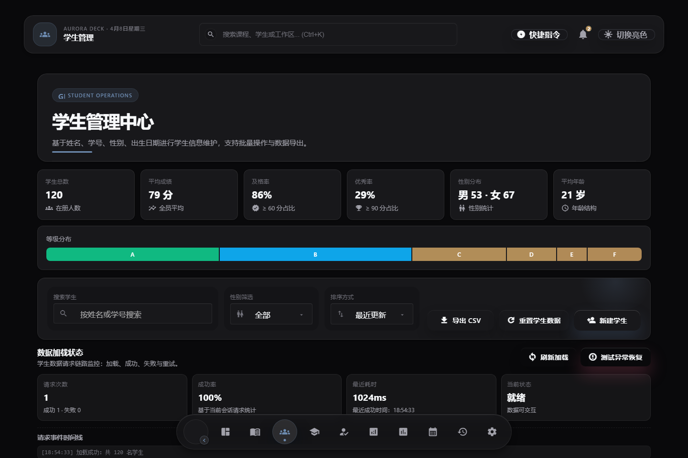
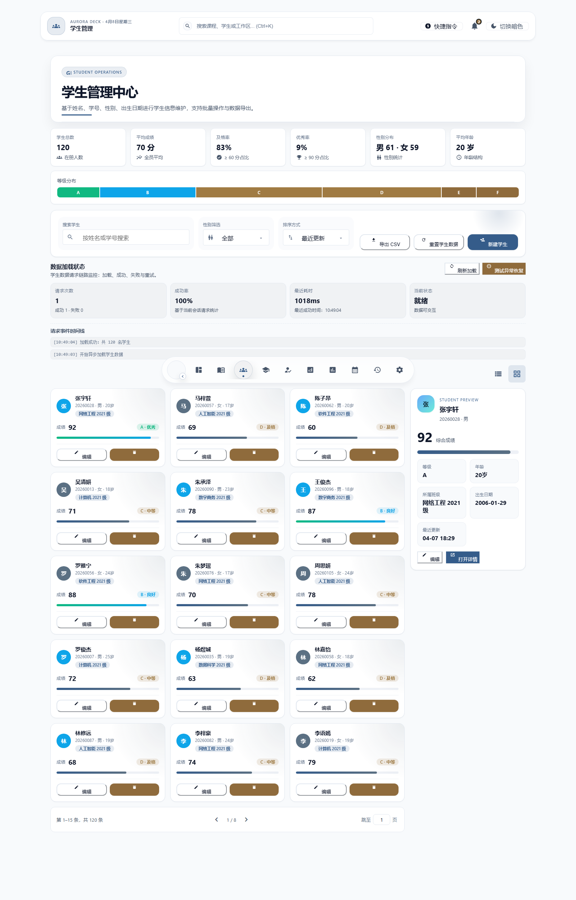
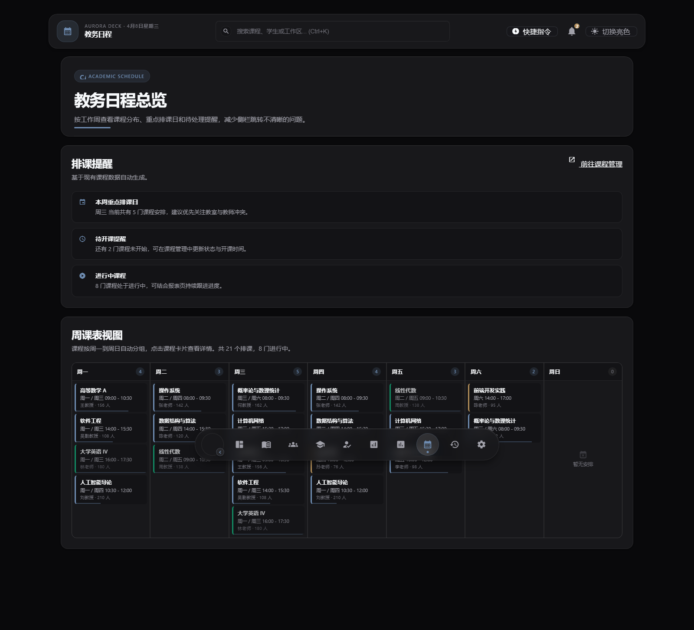
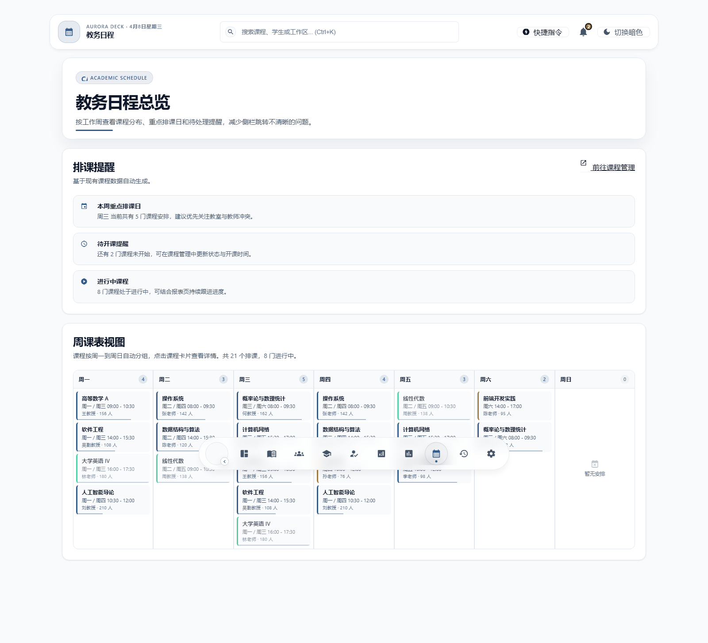

# Aurora Course Manager

一个基于 Angular 17 + Angular Material + FastAPI 的课程管理系统。  
当前版本延续 `Aurora Night Deck` 工作台风格：顶部 `Command Strip`、底部悬浮 `Dock`、亮暗双主题玻璃壳层，并已经完成前后端分离的第一阶段落地。

当前仓库不再只是“纯前端演示”：`server/` 下的 Python FastAPI 服务已接入真实 HTTP 接口、SQLite 持久化、Alembic 迁移与标准种子数据；前端 Students 页面已经通过 HTTP 获取班级资源并显示学生所属班级。

仓库地址：<https://github.com/2711944586/course-manager>

## Highlights

- `Mission Control` 首页：指标总览、风险雷达、推荐动作、运营时间线、最近工作区
- `Courses / Students` 工作台：搜索、筛选、排序、CRUD、局部预览、独立详情与编辑页
- `Analytics` 洞察面板：概览 / 对比 / 趋势分析三页签，本地计算与分析服务预留
- `Schedule` 周课表：按周一到周日自动分组，点击卡片弹出居中的课程详情弹层
- `Settings` 系统中心：主题切换、数据导出/导入/重置、系统配置入口
- 顶部全局搜索：支持 `Ctrl+K`
- 底部悬浮 Dock：`Dashboard / Courses / Students / Teachers / Enrollments / Analytics / Reports / Schedule / Activity Log / Settings`
- 底部中控台支持点击最左侧按钮展开 / 收起，并带有平滑开合动画

## 界面预览

> 截图放置在 `docs/screenshots/` 目录下。首次运行后通过浏览器截图补充。

| 页面 | 暗色主题 | 亮色主题 |
| ------ | ---------- | ---------- |
| Dashboard |  |  |
| Students |  |  |
| Schedule |  |  |

## Fullstack 升级进展

- 仓库内公开执行文档：`fullstack-modernization-plan.md`
- Python 后端骨架：`server/`
- 已完成 FastAPI 入口、配置基线、数据库 session 基线、`/api/v1/health` 健康检查、Alembic 迁移与最小 pytest 样例
- 已新增 `classes` 资源、学生 `classId` 关联字段、标准 seed 导入脚本与 SQLite 数据库初始化流程
- Students 页面已通过 HTTP 拉取班级列表，并在卡片、表格、导出 CSV 与详情预览中显示班级名称
- 当前前端仍处于“本地 store + API 资源逐步迁移”的过渡阶段，后续会继续把课程、教师、选课等模块迁移为 API 驱动

## 班级能力（本轮新增）

- 后端提供 `GET /api/v1/classes`、`GET /api/v1/classes/{id}`、`POST /api/v1/classes`、`DELETE /api/v1/classes/{id}`
- 学生模型新增 `classId`，旧本地数据会在加载时自动补齐默认班级
- Students 页面一次性拉取全部班级后建立 `classId -> className` 映射，避免重复请求
- 删除仍有关联学生的班级时，后端会返回 `409`，防止脏数据

## 技术栈

- Angular 17
- Angular Material
- Standalone Components
- Signals
- localStorage 持久化
- FastAPI
- SQLAlchemy + Alembic
- SQLite（开发环境）

## 本次重构重点

- 壳层升级为极夜玻璃舰桥风格
- 默认暗色主题，亮色主题同步完成细节适配
- 表单、下拉、通知面板、快捷指令面板、Dock、浮层统一走主题 token
- 修复页面滚动、路由切换、启动端口冲突、localStorage 脏数据容错等问题
- 周课表详情弹层改为真正居中显示，不再出现点击后偏右偏下
- Dock 悬浮标签去重，不再与额外 tooltip 重叠
- Dock 最左侧品牌按钮改为中控台开关，可一键展开 / 收起整组导航

## 快速开始

### 一键启动（推荐）

双击 `start-course-manager.bat`，脚本会自动完成：

1. 数据库迁移（Alembic）
2. 后端 API 服务启动（`http://127.0.0.1:8000`）
3. 前端依赖安装与开发服务器启动（`http://127.0.0.1:4200`）
4. 自动打开浏览器

关闭窗口即可停止前后端服务。

### 仅启动前端

```bash
npm install
npm run start
```

自动打开浏览器：

```bash
npm run start:open
```

开发脚本会自动寻找空闲端口，不再强依赖 `4200`。启动后以终端输出的地址为准。

### 启动完整前后端联调

1. 先按 `server/README.md` 完成后端依赖安装、数据库迁移与种子导入
2. 在 `server/` 目录启动 FastAPI 服务（默认 `127.0.0.1:8000`）
3. 回到仓库根目录执行 `npm run start`

前端当前默认请求 `http://127.0.0.1:8000/api/v1`。

## 常用脚本

```bash
npm run start          # 自动选择可用端口启动开发服务器
npm run start:open     # 自动选择可用端口并打开浏览器
npm run start:raw      # 直接用 4200 启动 ng serve
npm run build          # 生产构建
npm run test           # Karma 测试
npm run test:headless  # Headless 测试
```

## 主要模块

### Dashboard

- Mission Control 总览
- 风险卡、行动卡、最近工作区、运营时间线
- 图表：环形图 / 柱状图 / 折线图

### Courses

- 搜索、状态筛选、排序
- 课程卡片工作台 + 侧边预览
- 课程 CRUD、详情、编辑、CSV 导出

### Students

- 卡片 / 表格双视图
- 批量选择、分页、页码跳转
- 成绩分级、详情 / 编辑页
- 已展示学生所属班级，并支持导出班级列

### Teachers

- 教师列表与搜索
- 教师详情、课程关联总览

### Enrollments

- 选课记录管理与成绩录入
- 多维度筛选与排序

### Analytics

- 概览 / 对比 / 趋势分析三页签
- 风险雷达、趋势洞察、推荐动作
- 分析服务接口对接

### Reports

- 数据报表与统计图表
- 学生成绩分布、课程完成率等多维报告

### Schedule

- 自动生成周课表
- 排课提醒与活跃课程统计
- 点击课程卡片查看居中详情弹层

### Activity Log

- 操作日志时间线
- 按类型 / 实体筛选与搜索

### Settings

- 亮暗主题切换
- 数据导出 / 导入 / 清理 / 重置
- 分析服务配置
- 系统信息展示

## 数据与存储

- 班级资源当前存储在后端 SQLite 数据库中
- 学生、课程、教师、选课等主体数据当前仍以 `localStorage` 为主
- Settings 页可导出 JSON 备份
- Settings 页可重置课程、学生、教师、选课、活动日志、通知与最近工作区
- 项目内置标准种子课程、教师、学生与班级数据

## 项目结构

```text
src/
├── app/
│   ├── activity-log/
│   ├── analytics/
│   ├── core/
│   │   ├── models/
│   │   ├── services/
│   │   └── utils/
│   ├── course-detail/
│   ├── course-edit/
│   ├── course-list/
│   ├── dashboard/
│   ├── enrollments/
│   ├── reports/
│   ├── schedule/
│   ├── settings/
│   ├── sidebar/
│   ├── student-detail/
│   ├── student-edit/
│   ├── students/
│   ├── shared/
│   └── teachers/
├── assets/
└── styles.scss
```

## 说明

- 当前仓库处于渐进式前后端分离阶段：班级资源已走真实 API，其余主体资源将逐步迁移
- 分析相关能力当前仍以前端计算与接口预留为主，不会默认发起外部模型请求
- 后端实施说明见 `server/README.md`
- 根目录 `.env` 为本地开发配置文件，不纳入版本控制
- 如果浏览器仍停留在旧缓存页面，重新执行 `npm run start` 后强制刷新即可
